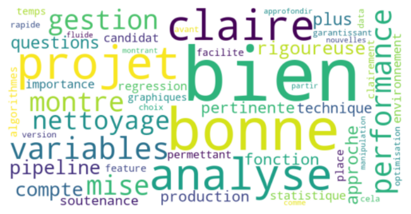

# Analysis of reviews received during my Data Science training et OpenClassrooms
The aim of the notebook is to analyze the word frequency of the evaluation written by reviewers of my projects during the Data Science training at OpenClassrooms.

Results are displayed as bar graph and wordcloud. 

 
